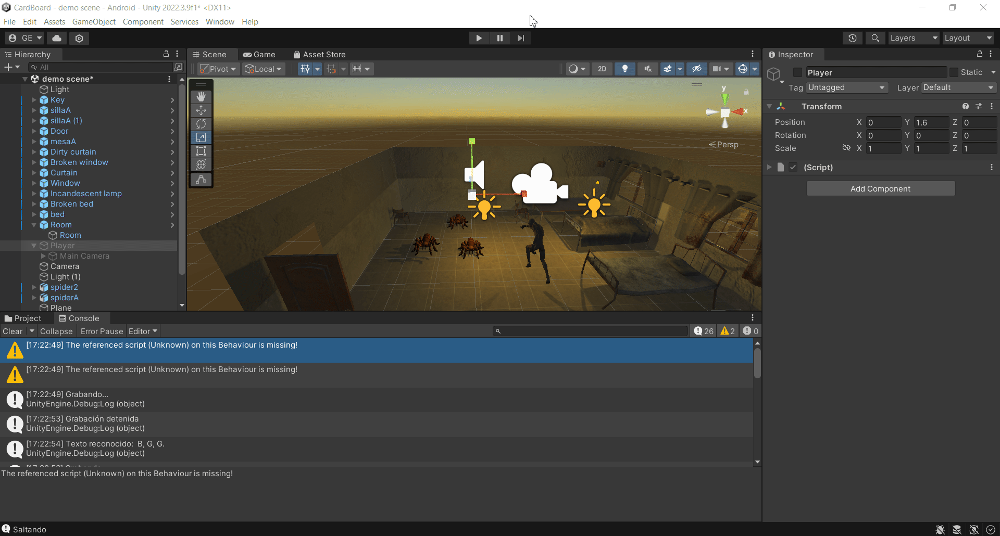

# II-Reconocimiento del habla

A continuación se muestran varios gifs de los ejercicios realizados en la práctica.

## Ejercicio 1

Apk usada para el ejercicio 1: [apk1](apks/ejercicio1.apk)

## Ejercicio 2

Script usado para el ejercicio 2: [script2](scripts/speech_recognition.cs)
